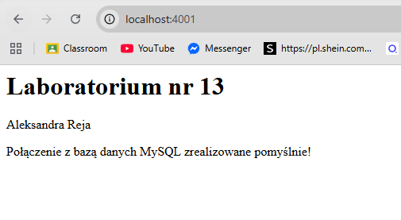
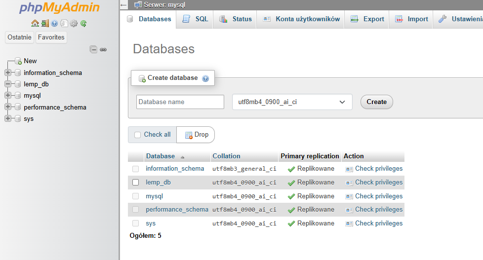
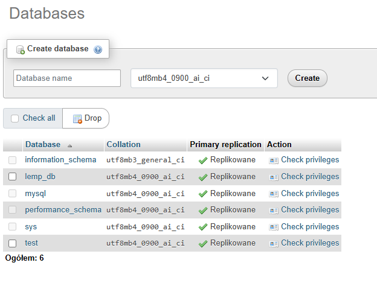

# Laboratorium PAwChO - Zadanie 13

### 1. Dane Autora
- **Imię i Nazwisko:** Aleksandra Reja
- **Grupa:** 6.7
- **Github** https://github.com/aleksandrareja/L13

## Opis kroków

### 1. Uruchomiono całe środowisko wielokontenerowe w trybie detach

```
docker compose up -d

[+] Running 6/6
 ✔ Network l13_backend        Created                                                                                                       0.5s 
 ✔ Network l13_frontend       Created                                                                                                       0.5s 
 ✔ Container lemp_mysql       Started                                                                                                      11.5s 
 ✔ Container lemp_php         Started                                                                                                      15.7s 
 ✔ Container lemp_phpmyadmin  Started                                                                                                      15.7s 
 ✔ Container lemp_nginx       Started
```

 ### 2. Zweryfikowano kondycję procesów kontenerowych za pomocą wbudowanego mechanizmu Docker Compose

```
 docker compose ps

NAME              IMAGE                  COMMAND                  SERVICE      CREATED         STATUS         PORTS
lemp_mysql        mysql:8.3.0            "docker-entrypoint.s…"   mysql        3 minutes ago   Up 3 minutes   3306/tcp, 33060/tcp
lemp_nginx        nginx:1.25.4-alpine    "/docker-entrypoint.…"   nginx        3 minutes ago   Up 3 minutes   0.0.0.0:4001->80/tcp, [::]:4001->80/tcp
lemp_php          php:8.3.4-fpm-alpine   "docker-php-entrypoi…"   php          3 minutes ago   Up 3 minutes   9000/tcp
lemp_phpmyadmin   phpmyadmin:5.2.1       "/docker-entrypoint.…"   phpmyadmin   3 minutes ago   Up 3 minutes   0.0.0.0:6001->80/tcp, [::]:6001->80/tcp
```

### 3. Sprawdzono poprawność renderowania strony startowej oraz udowodniono poprawną wymianę pakietów na styku PHP <-> MySQL za pomocą narzędzia curl

```
curl http://localhost:4001

<h1>Laboratorium nr 13</h1><p>Aleksandra Reja</p>Połączenie z bazą danych MySQL zrealizowane pomyślnie!
```



### 4. Sprawdzono możliwość utworzenia bazy danych





## Uzasadnienie dla phpMyAdmin
Kontener `phpmyadmin` musi być podłączony do obu sieci jednocześnie (`frontend` i `backend`) z dwóch powodów:
1. **Z sieci frontend** korzystamy my - dzięki niej możemy otworzyć panel graficzny w przeglądarce na naszym komputerze (na porcie `6001`).
2. **Z sieci backend** korzysta sam phpMyAdmin - dzięki niej widzi w tle kontener bazy danych `mysql` i może się do niego zalogować.
